# DevExpressInspiredControls

A dependency-free .NET 10 WPF control foundation inspired by the DevExpress
Office2019Colorful visual language. The project uses standard WPF templates,
dependency properties, commands, bindings, validation, keyboard navigation, and
UI Automation.

This is an independent project. It does not include or redistribute DevExpress
source code, assemblies, icons, or theme assets.

**Target framework:** `net10.0-windows`

## Solution layout

| Path | Description |
|------|-------------|
| `src/DevExpressInspiredControls` | Control library and theme resources |
| `samples/DevExpressInspiredControls.Demo` | MVVM gallery application |
| `tests/DevExpressInspiredControls.Tests` | STA WPF regression tests |
| `tools/DevExpressInspiredControls.Capture` | Off-screen renderer that writes control PNGs |
| `docs/images/controls` | Screenshots of each control |

## Prerequisites

- Windows 10 or later
- [.NET 10 SDK](https://dotnet.microsoft.com/download)
- Visual Studio 2026, Cursor, or another editor with WPF support

## Build

```powershell
dotnet build DevExpressInspiredControls.slnx
```

## Run the gallery

```powershell
dotnet run --project samples/DevExpressInspiredControls.Demo/DevExpressInspiredControls.Demo.csproj
```

## Test

```powershell
dotnet test tests/DevExpressInspiredControls.Tests/DevExpressInspiredControls.Tests.csproj
```

## Using the library

1. Add a project reference to `src/DevExpressInspiredControls/DevExpressInspiredControls.csproj`.
2. Merge the theme dictionary in `App.xaml`:

```xml
<Application.Resources>
    <ResourceDictionary>
        <ResourceDictionary.MergedDictionaries>
            <ResourceDictionary
                Source="/DevExpressInspiredControls;component/Themes/Office2019Colorful.xaml" />
        </ResourceDictionary.MergedDictionaries>
    </ResourceDictionary>
</Application.Resources>
```

3. Use the themed controls and the custom switch with normal MVVM bindings:

```xml
<Window
    xmlns:controls="clr-namespace:DevExpressInspiredControls.Controls;assembly=DevExpressInspiredControls">
    <controls:ToggleSwitch
        Content="Feature"
        IsChecked="{Binding IsFeatureEnabled, Mode=TwoWay}"
        Command="{Binding FeatureChangedCommand}" />
</Window>
```

### Demo gallery

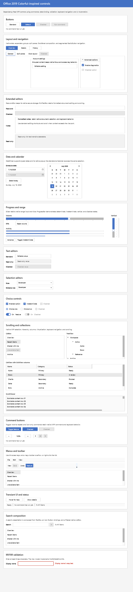

Regenerate screenshots:

```powershell
dotnet run --project tools/DevExpressInspiredControls.Capture -- docs/images/controls
```

#### Buttons

| Control | Preview |
|---------|---------|
| `Button` | 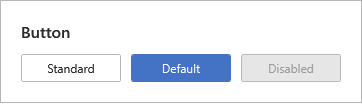 |

#### Editors

| Control | Preview |
|---------|---------|
| `TextBox` | 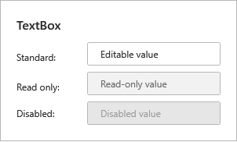 |
| `ComboBox` | 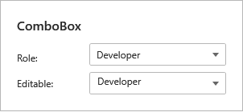 |

#### Choice

| Control | Preview |
|---------|---------|
| `CheckBox` | 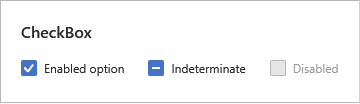 |
| `RadioButton` | 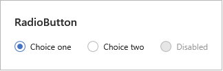 |
| `ToggleSwitch` | 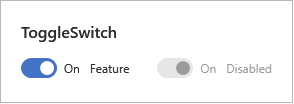 |

#### Scrolling and collections

- `ScrollBar` and `ScrollViewer`
- `ListBox` and `ListBoxItem`
- `ListView`, `ListViewItem`, and `GridViewColumnHeader`
- `TreeView` and `TreeViewItem`

#### Commands and transient UI

| Group | Preview |
|-------|---------|
| `ToggleButton`, `RepeatButton`, and icon buttons | 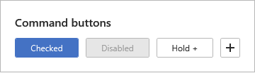 |
| `Menu`, `MenuItem`, and `ContextMenu` | 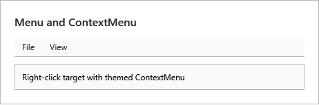 |
| `ToolBar` and `Separator` | 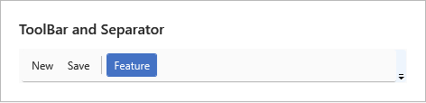 |
| `ToolTip`, popup chrome, and `StatusBar` | 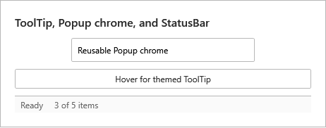 |
| Search composition | 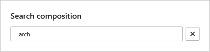 |

Search remains an MVVM composition of `TextBox`, an icon-styled `Button`, and
native collection controls; the library does not define a domain-specific
search control.

#### Layout and navigation

| Group | Preview |
|-------|---------|
| `TabControl`, `TabItem`, `Expander`, `GroupBox`, `GridSplitter`, and segmented navigation | 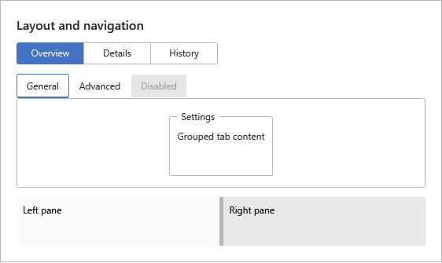 |

Layout recipes use native `Grid`, `DockPanel`, shared-size groups, and
`GridSplitter`; the library does not define an application shell or custom
split container.

#### Input and status

| Group | Preview |
|-------|---------|
| `PasswordBox` and `RichTextBox` | 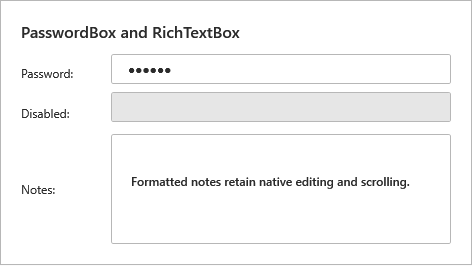 |
| `DatePicker` and `Calendar` | 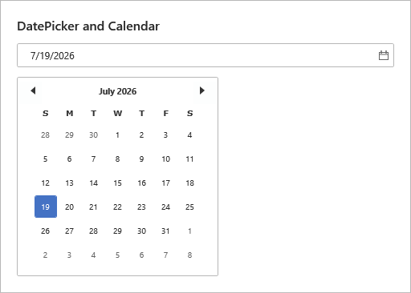 |
| `Slider` and `ProgressBar` | 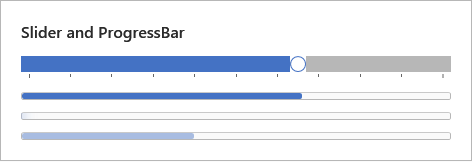 |

Theme tokens (colors, brushes, fonts, metrics) live under `src/DevExpressInspiredControls/Themes/`.

## Documentation

- [Getting started](docs/getting-started.md)
- [Architecture and theming](docs/architecture.md)
- [Composable control roadmap](docs/control-roadmap.md)
- [Demo and recording guide](docs/demo-guide.md)
- [Optional DevExpress integration](docs/devexpress-integration.md)
- [Contributing](CONTRIBUTING.md)
